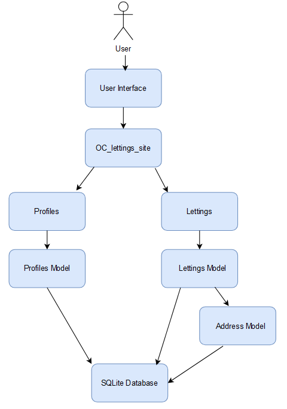

Database and Model Structure
============================

The data is stored on a SQLite3 database included in the Django project container.
This document explains the database structure and the main models used in the project.

The project is divided into 2 applications :

**Profiles** :

    - Description : Handles user profiles.

**Lettings** :

    - Description : Manages the letting listings.

**OC_Lettings_Site** :

    - Description : Contains the project settings and URL configurations.

