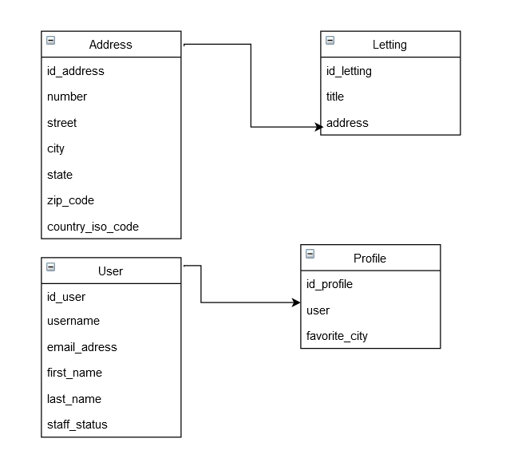

Database and Model Structure
============================

This section describes the database structure and the main models used in the Django project.

The data is stored on a SQLite database included in the Django project container.

**OC_Lettings_Site** is the main project. It acts as a central point and consists of:

- settings.py : for the overall configuration of the project.
- urls.py : for managing routes and URLs.
- The integration of internal applications: Profiles and Lettings.

The project is structured around two main applications:

**Profiles** : for managing user profiles.

**Lettings** : for managing rental listings.

These two applications encapsulate the specific functionalities and manipulate the corresponding data, while **OC_Lettings_Site** ensures the coordination and overall integration.

This diagram represents the Conceptual Data Model (CDM) of the project.
It illustrates the main entities (User, Profile, Address, Letting) and their relationships:

Each User can have a Profile, which includes additional information such as the preferred city.
Each Letting is associated with an Address, detailing the number, street, city, and other location-related information.

