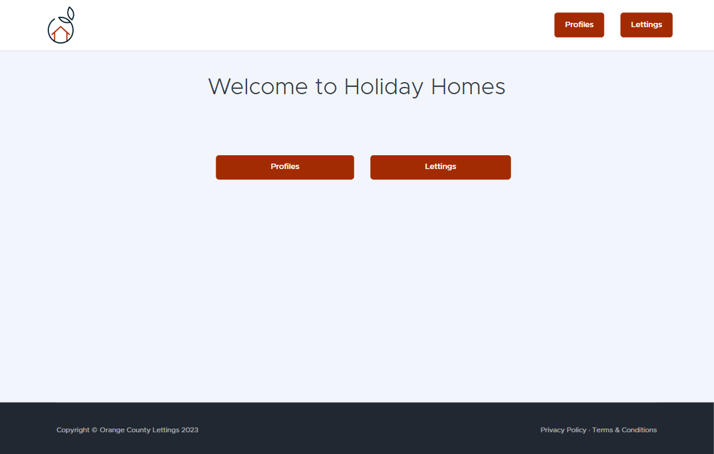
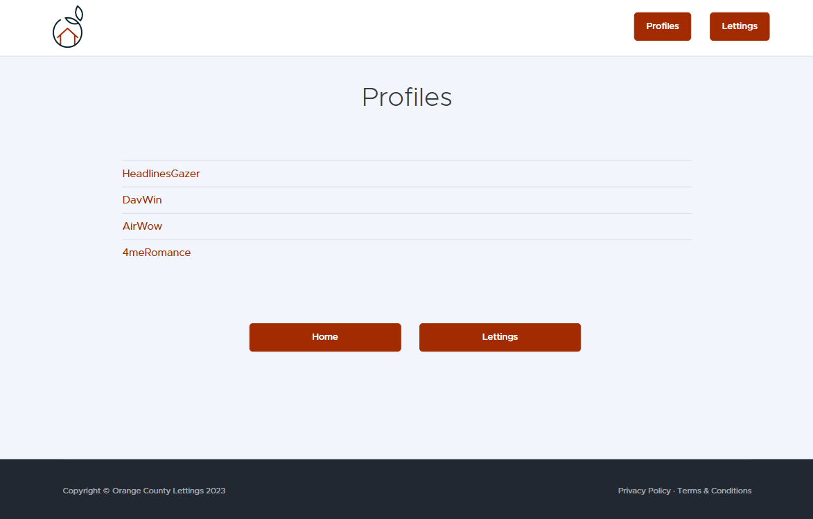
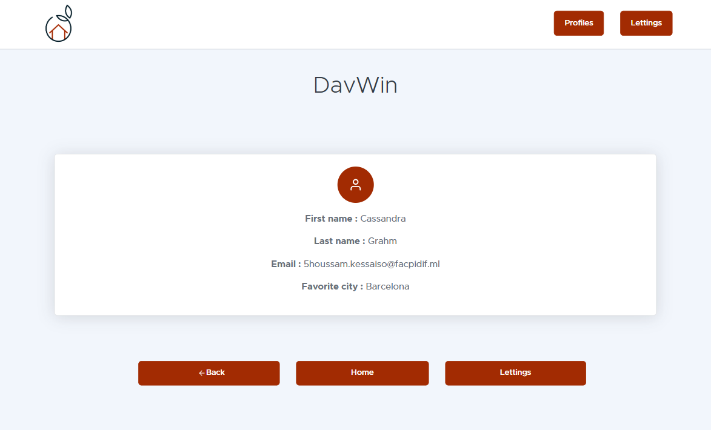
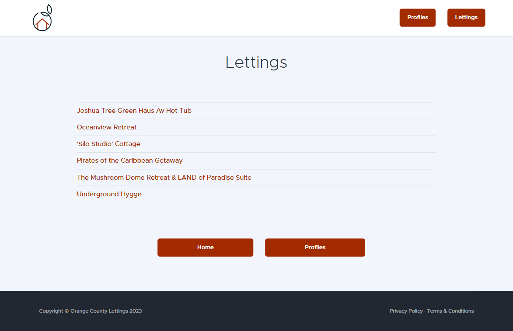
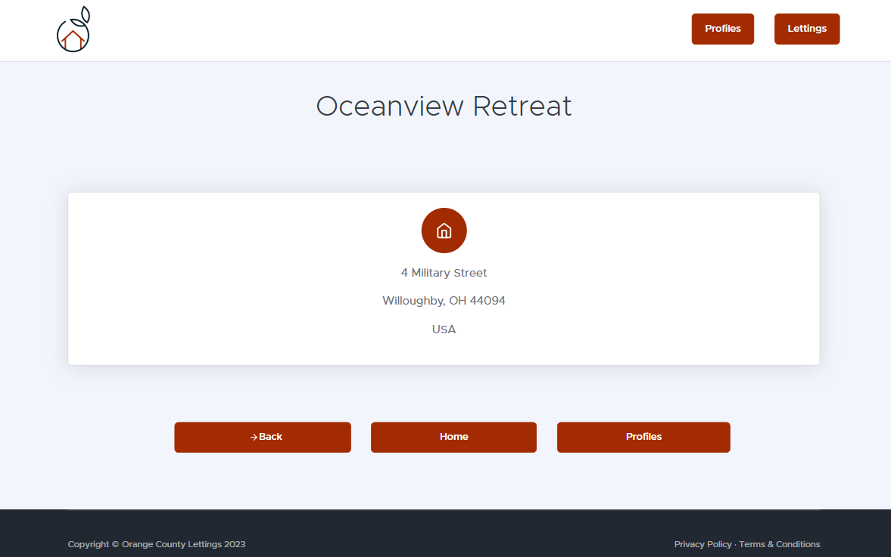

User Guide
==========

This guide explains how to use the main features of the application.

Home
----

The Home page serves as the entry point to the application. It provides an overview of the platform, allowing users to easily navigate to key sections such as Profiles and Lettings.
Quick links to navigate to user profiles and rental property listings.

Profiles
--------

The Profiles section allows users to view user accounts.
Click on a specific profile to view its details, including the name, email, and any related preferences.

Each profile contains details about a specific user.

Lettings
--------

The Lettings section showcases all available rental properties. Users can browse through the listings and view detailed information about each property.

View detailed information about a property, such as its address.

